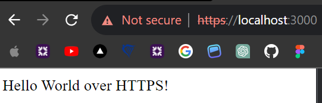

# Backend Worksheet

Welcome to the Activity Worksheet! This worksheet contains three exciting activities for you to complete.
Follow the instructions for each activity, modify this readme file accordingly, and mark the activity as done by placing a tick mark (✅) next to the activity title.

## Instructions 📋

Before you begin, make sure you have forked this repository. To fork the repo, follow these steps:

1. **Fork the Repository** 🚀

   Click on the "Fork" button at the top right corner of this repository's page. This will create a copy of the repository in your GitHub account.

2. **Clone the Forked Repo** 📥

   Once the fork is complete, clone the forked repository to your local machine using the following command in your terminal or command prompt:

   ```bash
   git clone <your-forked-repo-url>
   ```

3. **Work on the Codebase and Modify the Readme** 💻

   Now, you are free to work on the codebase, make changes, and modify the readme file as instructed in the activities.

4. **Install Dependencies** 📦

   If the project requires any dependencies, make sure to install them using the appropriate package manager (npm or yarn).

5. **Commit Changes** 💬

   As you make changes to the code or readme, commit them with meaningful messages to track your progress.

   ```shell
   git add .
   git commit -m "Your commit message here"
   ```

6. **Push to Your Forked Repo** 📤

   Once you have completed the activities and are satisfied with your changes, push the changes to your forked repository on GitHub.

   ```bash
   git push origin main
   ```

7. **Share Your Forked Repo Link** 🔗

   After accomplishing the activities, share the link of your forked repository with your mentor. They will be able to review your work and provide feedback.

**Note: Please do not modify this original repository directly or create a Pull Request (PR) for it. All your changes should be made in your forked repository only 🛑**

Remember, your forked repository is your personal copy, and you can freely experiment and work on it without affecting the original repository. Happy activiting! 🚀

## Config 🛠️

For each project, find the `.env.example` file in the project's root directory. Duplicate the file and rename it to `.env`. Fill in the required credentials and keys.

- **MongoDB**: Four projects in this repository use MongoDB as the database. You'll need to create your own MongoDB account, get the URI, and replace it in the .env file.
- **Supabase**: For the Supabase project, you'll need to create an account on Supabase, obtain the URL and API keys, and configure the .env file accordingly.
  Additionally, you'll need to set up the required table structure in your Supabase project. Take a look at a few lessons from this [Crash Course](https://youtube.com/playlist?list=PL4cUxeGkcC9hUb6sHthUEwG7r9VDPBMKO) to learn and understand how to do that

## Activity 1 - Exploration ✨

Take a close look at the code project given, i.e.,

- [Vanilla Node.js API](/vanilla-nodejs) - built a simple https demo app using Vanilla - see https-req-res
- [Express.js API](/expressjs). - have included past projects where I have implemented these technologies
- [Next.js API Routes](/nextjs-apiroutes)
- [Next.js Server Actions](/nextjs-serveractions) - our current project Morent implements these technologies
- [Supabase](/supabase) - see below, I have included a past project where these technologies have been implemented

Run the project and try it out to notice we can create APIs or use BaaS (Backend as a Service) differently.
Finally, write down the good and bad points of each method and when you think it's better to use one method over the other. Share your observations below.

```
📝 Share your answer here
```

## Activity 2 - Integration 💻

(✅) Once you've familiarized yourself with all the approaches, attempt to create an API for the Car Rent Project.
Your task is to create a complete CRUD API for at least one model or schema (i.e., Car or User) using any of the above approaches.

🌟 **Bonus Challenge**: Take it a step further and create all versions using all the mentioned approaches. Feel free to explore and build all separate projects to practice
and compare the functionalities of Vanilla Node.js, Express.js, Next.js API Routes, Next.js Server Actions, and Supabase.

```
🎯 Share the Project link here
```

# The projects below are past projects.

### Supabase project

I built this project as a way of learning NextJS version 13, making use of getServerSideProps etc.
It was also the first project where I used Supabase. I used react-hook-form and implemented CRUD for displayed products.

[Deployed on Vercel](https://next-drelix.vercel.app/pants)

[GitHub Repository](https://github.com/AlexDjangoX/next-drelix)

### NodeJS / Express

This project was built with with NodeJS/Express, JWT, Prisma. The entry point for the application is app.js. Some routes are protected, utilizing JWT web tokens, and jwtCheck function as middleware. The backend flow is then to the the routes, then to the controllers, where DB queries are executed using the prisma client.

Front end is bootstrapped with create-react-app. I later built the same project using NextJS version 13

[Polish-conjugation](https://conjugate-server.vercel.app/kanban)

[GitHub client](https://github.com/AlexDjangoX/conjugate-client)

[GitHub server](https://github.com/AlexDjangoX/conjugate-server)

**Note**: You can create a new project in the same repository. Set up a fresh folder for this activity project, and you're ready to get started!

## Activity 3 - Reflection 📚

Let's take a moment to reflect on what you've learned so far through this activity.
Take your time and conduct thorough research to answer the following questions thoughtfully. These questions are designed to reinforce your foundational knowledge on this topic and help you prepare for interviews.
Avoid copy-pasting; instead, read, reread, and write each word in your own words.

1. ❓ **Describe the core differences between the HTTP and HTTPS modules in Node.js. How would you set up an HTTPS server?**(✅)

   ```
   See https-req-res for secure server and front end which will send a request to secure server

   📝Both are protocols, a set of rules, for transferring data over the web. HTTP does not encrypt data, so leaves it vulnerable. HTTPS encrypts data during transmission between browser and server. To build a HTTPS server with Node.js, HTTPS uses TLS (Transport Layer Security) and SSL (Secure Sockets Layer). Modern web uses TLS. The SSL certificate can be generated locally. To create a self-signed certificate we run the following on CL, this will generate a self-signed certificate for testing and dev:

   openssl req -nodes -new -x509 -keyout secure-server/config/ssl/server.key -out secure-server/config/ssl/server.cert


   openssl - OpenSSL command-line
   req - request to create either self-signed or CSRs
   -nodes - no passphrase will be required
   -x509 - self-signed, not submitted to CSR
   -keyout - the server.key will have the private key
   -out - server.cert will have the self-signed certificate

   update .gitignore

   /config/ssl/*
   !config/ssl/.gitkeep - this will commit an empty directory

   Now that I have these I can set up an HTTPS server in Node.js.

   For this to work locally, we must use mkcert, which will generate a valid SSL certificate for local dev. mkcert acts as a Certificate Authority (CA)

   mkcert create-ca
   mkcert create-cert --key localhost-key.pem --cert localhost.pem

   Absent that we get this error - as expected

   GET https://localhost:3000/ net::ERR_CERT_AUTHORITY_INVALID

   After setting up mkcert, and generating the certificates, I still got warnings from my browser, but proceeded and got the expected response from the server.
   ```



To remedy this I can:

- Get a Certificate from a Recognized CA - production.
- Upload the generated config/ssl/ca.crt into my browser's trust store.

```

2. ❓ **What is Express.js, and why is it commonly referred to as a "web application framework for Node.js"?(✅)
Highlight the key features and advantages that Express.js brings to the development of web applications.**

```

📝 Express.js is software framework, which means it provides a standard way to build and deploy applications. This means we do not have to re-invent the wheel every time we want to build an application. Express is specifically used to build applications that run on Node.js runtime, it uses a non-blocking, asynchronous I/O model. I used Express.js to build the https secure server provided in the above answer. It comes with some key functionality - routing, middleware integration, simple server creation.

```

3. ❓ **Describe the basic structure of an Express.js application. What are routes and how are they defined?(✅)
How does middleware fit into the request-response cycle, and what purpose does it serve in Express.js?**

```

📝 With reference to code in https-req-res:

- creating an express instance, then we can create routes, use middleware and listen on specific ports for incoming requests.

`const app = express();`

- create routes. Routes define the endpoints at which requests can be made, the HTTP method (GET, POST, etc.), and the code that should be executed when the route is matched. In the provided code:

`app.get('/', (req, res) => {res.send('Hello World over HTTPS!');});`

- This code defines a GET route for the root URL ('/'). Any incoming GET request to this URL will trigger the callback function, which sends the message "Hello World over HTTPS!" back to the client.

- middleware have access to the request response objects, as well as the next middleware function, they can execute any code, modify request response objects. An example of this in above code base is the cors middleware, which will allow cross-origin requests, in the example above the server runs on localhost:3000, and the client was running on localhost:3001, using cors middleware allows this:

`app.use(cors());`

Typically we can incorporate functionality like authorisation by employing middleware, a layer between the incoming request, which must allow progress to a given protected route.

```

4. ❓ **Explain the purpose of serverless functions in the context of Next.js API routes. How do they impact scalability and deployment?**(✅)

```

📝 In Next.js we can build applications without the need to create a server, as we needed to do when we had an express/vanilla application above.
It has a feature known as API routes, which act as serverless functions. They offer a simplified backend integration. With NextJS we can have a single code base in which we can have all our front and back code. By treating API routes as serverless functions, Next.js allows for code splitting, not only of front end but also backend - ensuring only required backend code runs for a particular route - giving optimized performance. Serverless functions fire in response to events.

Serverless auto-scale. Each new request is handled by a new instance of the function, they are also stateless.

Deployment onto platforms like Vercel are super simple.

```

5. ❓ **Explain the fundamental concept of Next.js Server Actions. How do they differ from standard API routes in Next.js?(✅)
Provide a high-level overview of how Server Actions allow you to handle complex server-side logic efficiently in a Next.js application.**

```

📝 Nest.js Server Actions differ fundamentally in that you do not have to write any routes. Functions are defined on the server side code base, then can be imported into client side components and executed on the client side, but the functions are fired server side.(✅)

- no explicit server creation
- no explicit routing
- seamless integration into front-end
- simplified logic
- enhanced security - since logic executes server side, protecting API keys etc.
- optimized performance - requests are more direct

```

6. ❓ **Provide an overview of Supabase and its main features.
How does Supabase differ from traditional relational databases, and what advantages does it offer in terms of real-time functionality, authentication, and API generation?**

```

📝 Supabase adds real-time capabilities to instantly observe data changes. It auto-generates CRUD APIs based on PostgreSQL schemas, simplifying backend development. Integrated authentication streamlines user management, eliminating third-party dependencies. It offers real-time, authentication, and swift API generation in one platform.

```

7. ❓ **Provide an overview of Supabase and its main features.
How does Supabase differ from traditional relational databases, and what advantages does it offer in terms of real-time functionality, authentication, and API generation?**

```

📝 Supabase extends PostgreSQL, adding features essential for modern apps. While traditional databases store and manage data, Supabase introduces real-time updates, built-in authentication, and instant API generation.

```

8. ❓ **In a Supabase-powered application, how would you structure the database schema to handle different data entities, relationships, and constraints?
Provide an example of designing a database schema for a blog platform that includes articles, authors, and comments.**

```

📝 I have exceeded my free project limit on Supabase platform. Please see past projects for Supabase implementation.

```

9. ❓ **Your team is developing a social media analytics dashboard that aggregates data from various social media platforms and presents insights to users. The backend needs to handle data processing, storage, and retrieval efficiently. Which backend technology would you use to build the analytics dashboard?
Explain your decision-making process, highlighting the scalability, data processing capabilities, and data storage solutions provided by the chosen technology.**

```

📝 Your answer here

````

10. ❓ **You're building a real-time chat application similar to Slack, where users can send messages, join channels, and receive instant notifications. The backend needs to handle message broadcasting, user presence updates, and message history storage.
 Which backend technology would you use for building the chat application's backend, and what factors make this technology suitable for managing real-time interactions and data storage?**

 ```
 📝 Your answer here
 ```
````
